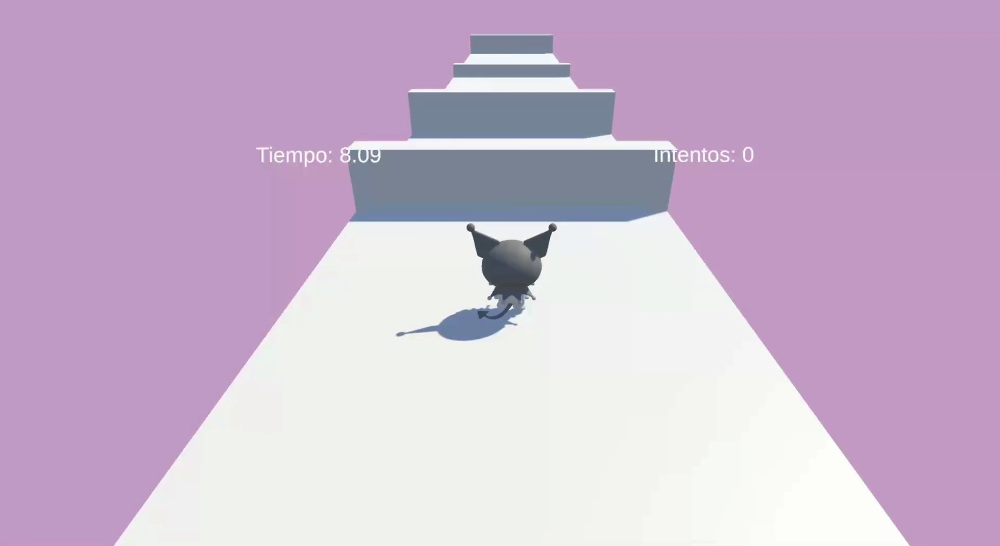
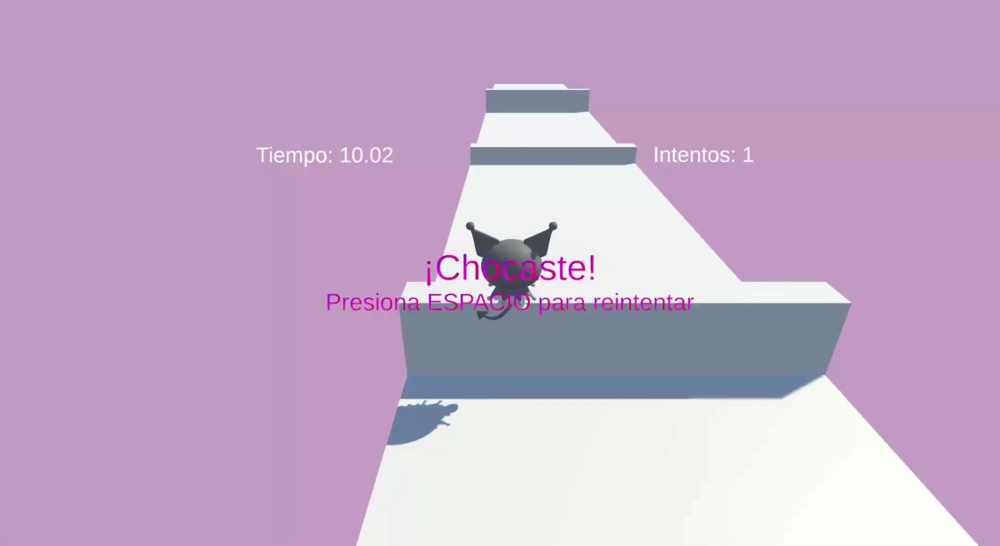
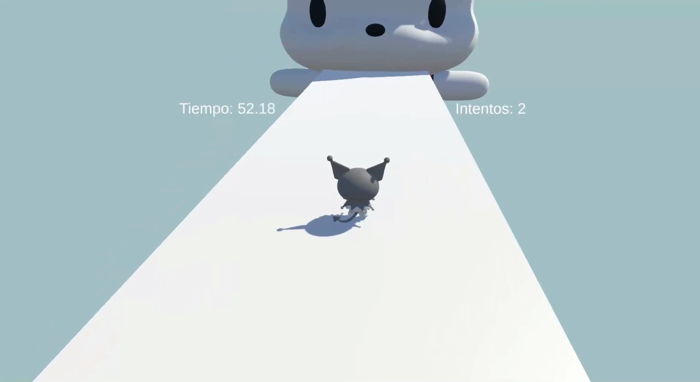
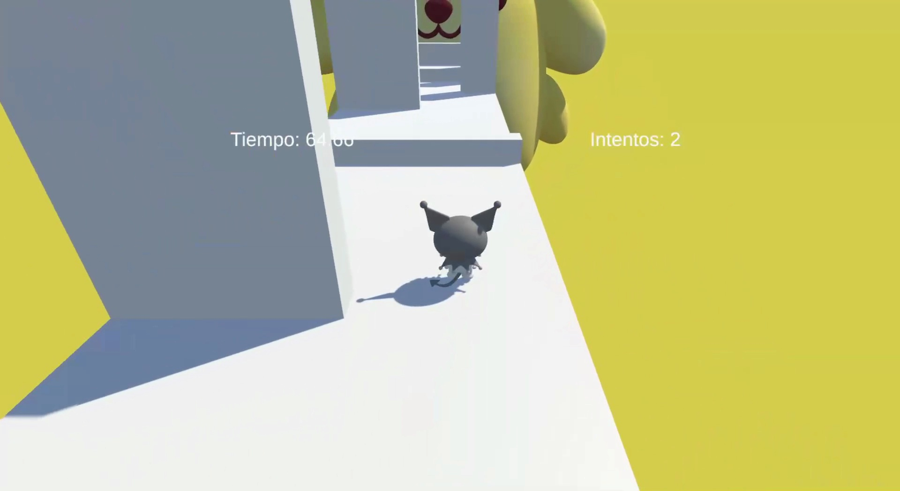

#  Kuromi Adventure 🌙


---

## 🎥 Gameplay

[](https://youtu.be/x0OE-Ph-oOg)


<div align="center">

  <table>
    <tr>
      <td align="center">
        
      </td>
      <td align="center">
        
      </td>
    </tr>

    <tr>
      <td align="center">
        
      </td>
      <td align="center">
        
      </td>
    </tr>

    <tr>
      <td align="center" colspan="2">
        
      </td>
    </tr>
  </table>

</div>

---

## 📚 About the Game

A runner-style game where Kuromi navigates through obstacles and levels to reunite with her partner, Badtz-Maru.

- 3 progressive levels  
- Increasing difficulty  
- Boss encounters in later stages  
- Player movement and obstacle avoidance

---

## 📱 Mobile Support

This project includes mobile input handling and can run on Android devices.

- Touch controls implemented  
- Built and tested for Android  

---

## 🛠️ Requirements

- Unity 2022.3.62f1 (LTS)

> Use the same version to avoid compatibility issues.

---

## 🚀 Run Locally

```bash
git clone https://github.com/MexboxLuis/Kuromi-Adventure.git
cd Kuromi-Adventure
```

## ⚠️ Disclaimer
This is a personal/educational project. Characters are used as references and are not intended for commercial use.